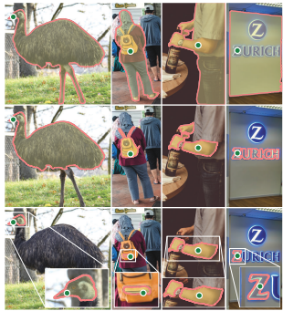

# sam

## **Introduction**

본 논문의 목표는 image segmentation을 위한 foundation model을 구축하는 것이다. 

이 계획의 성공은 세 가지 요소, task, 모델, 데이터에 달려 있다. 
이를 개발하기 위해 image segmentation에 대한 다음 질문을 해결한다.

1. Zero-shot 일반화를 가능하게 하는 task는 무엇인가?
2. 해당 모델 아키텍처는 무엇인가?
3. 어떤 데이터가 이 task와 모델에 힘을 실어줄 수 있는가?

## **Segment Anything Task**

각 열은 단일 모호한 포인트 프롬프트(녹색 원)에서 SAM이 생성한 3개의 유효한 마스크를 보임

- 저자들은 다음 토큰 예측 task가 foundation model 사전 학습에 사용되고 프롬프트 엔지니어링을 통해 다양한 하위 task를 해결하는 NLP에서 영감을 얻음.
- Segmentation을 위한 foundation model을 구축하기 위해 유사한 능력을 가진 task를 정의하는 것을 목표

### **Task**

- 프롬프트의 아이디어를 NLP에서 segmentation으로 변환하는 것으로 시작
- 프롬프트는 전경/배경 점, 대략적인 박스 또는 마스크, 자유 형식 텍스트 또는 일반적으로 이미지에서 segmentation 대상을 나타내는 모든 정보일 수 있음.
- Promptable segmentation task는 프롬프트가 주어지면 유효한 segmentation mask를 반환
- “유효한” 마스크의 요구 사항은 프롬프트가 모호하고 여러 객체를 가리킬 수 있을 때에 대해 출력이 그 객체 중 적어도 하나에 대한 합리적인 마스크여야 함을 의미
- 모호한 프롬프트에 대해 일관된 응답을 출력하는 언어 모델을 기대하는 것과 유사
- 자연스러운 사전 학습 알고리즘과 프롬프팅을 통해 하위 segmentation task로의 zero-shot trasfer를 위한 일반적인 방법으로 이어지기 때문에 이 task를 선택하는 이유임

### **Pre-training**

- Promptable segmentation task는 각 학습 샘플에 대한 일련의 프롬프트(ex. 점, 박스, 마스크)를 시뮬레이션하고 모델의 마스크 예측을 ground-truth와 비교하는 자연스러운 사전 학습 알고리즘을 제안
- 충분한 사용자 입력 후에 결국 유효한 마스크를 예측하는 것이 목표인 interactive segmentation과 달리 이 방법을 적용
- 프롬프트가 모호한 경우에도 모든 프롬프트에 대해 항상 유효한 마스크를 예측하는 것이 목표
- 데이터 엔진에서 요구하는 자동 주석을 포함하여 모호성이 포함된 use case에서 
사전 학습된 모델이 효과적임을 보장
- task를 잘 수행하는 것이 어렵고 전문적인 모델링 및 학습 loss 선택이 필요하다는 점에 주목

### **Zero-shot transfer**

- 사전 학습 task는 모델이 inference 시간에 모든 프롬프트에 적절하게 응답할 수 있는 능력을 
부여하므로 하위 task는 적절한 프롬프트를 엔지니어링하여 해결할 수 있음
- 예를 들어, 고양이에 대한 boundary box detector가 있는 경우 detector의 box 출력을 모델에 
프롬프트로 제공하여 고양이 instance segmentation를 해결할 수 있다.
- 일반적으로 다양한 실용적인 segmentation task는 프롬프트로 캐스팅될 수 있다.

### **Discussion**

- Prompting과 composition은 단일 모델을 확장 가능한 방식으로 사용하여 잠재적으로 모델 설계 시 알려지지 않은 task를 수행할 수 있도록 하는 강력한 도구
- 이 접근 방식은 다른 foundation model이 사용되는 방식과 유사
- 저자들은 프롬프트 엔지니어링과 같은 기술로 구동되는 composition 가능한 시스템 설계가 고정된 일련의 task를 위해 특별히 학습된 시스템보다 더 다양한 애플리케이션을 가능하게 할 것으로 예상
- Ccomposition의 관점에서 promptable segmentation과 interactive segmentation을 비교하는 것도 흥미롭다.
- interactive segmentation model은 인간 사용자를 염두에 두고 설계되었지만 promptable segmentation을 위해 학습된 모델은 더 큰 알고리즘 시스템으로 구성될 수 있다.

## **Segment Anything Model**

Segment Anything Model (SAM)에는 위 그림에 나와 있는 것처럼 세 가지 구성 요소가 있다.

1. Image encoder(이미지 인코더)
2. flexible prompt encoder(유연한 프롬프트 인코더)
3. fast mask decoder(빠른 마스크 디코더)

저자들은 실시간 성능에 대한 특정 trade-off가 있는 Transformer 비전 모델을 구축하였다.

- 이미지 설명
    
    **1. MAE(Masked AutoEncoder 모델) [2]의 인코더를 적용한 이미지 인코더** 
    
    - MAE는 75%가 마스크되어 있는 일반 비중복 패치로 분할된 이미지에 대해 사전 학습되었습니다.
    - 이미지 변환 후 인코더는 마스크되지 않은 패치를 수신하고 이를 임베딩 벡터로 인코딩
    - 그런 다음 이 벡터는 원본 이미지를 재구성하기 위해 디코더를 통과하기 전에 마스크 토큰(예측해야 하는 누락된 패치를 식별하는)과 위치 임베딩에 연결
    
    
    
    MAE 모델의 학습 과정
    
    **이 전체 프로세스에서 가장 중요한 부분은 어떤 패치를 마스킹해야 하는지 결정하는 것**
    
    - 이는 높은 마스킹 비율(75%)과 함께 보이는 인접 패치에서 단순히 추정하는 것만으로는 해결할 수 없는 복잡한 이미지 재구성 작업을 보장하는 교체 없는 무작위 샘플링에 의존
    - 따라서 인코더는 디코더가 원본 이미지를 올바르게 재구성할 수 있도록 이미지의 고품질 벡터 표현을 생성하는 방법을 배워야 함
    - 이미지 인코더를 조정하여 64x64 크기와 256개 채널의 원본 이미지를 16배 축소한 임베딩을 생성했습니다.
    
    **2. 유연한 프롬프트 인코더에는 제공된 프롬프트에 따라 트리거되는 네 가지 구성 요소 존**
    
    - 마스크는출력 채널이 각각 4와 16인 커널 2x2 및 스트라이드-2 컨볼루션 작업을 사용하여 이미지를 4배로 2배 축소하는 컨볼루션 신경망으로 표현
    - 그 후 1x1 convolution은 채널 차원을 256으로 매핑
    - 그 다음 Image Encoder의 출력에 요소별로 추가
    - 마스크가 제공되지 않으면 *"no mask"* 이라는 학습된 임베딩 표현이 마스크 임베딩을 대체
    
    
    
    SAM 아키텍처에서 마스크 프롬프트 처리
    
    - 포인트는 위치 임베딩과 해당 포인트가 배경에 있는지 전경에 있는지를 나타내는 두 가지 학습된 임베딩 중 하나로 표시
    - 위치 임베딩은 [3]의 저자가 개발한 작업을 적용하여 달성
    - 생성된 출력을 크게 향상시키는 MLP(Multi Layer Perceptron)를 공급하기 전에 점의 좌표가 푸리에 기능에 매핑
    - 그림 5에서 볼 수 있듯이 이미지 회귀 작업의 경우 모델은 Fourier features을 사용할 때 흐릿하지 않은 이미지를 생성 가능
    - SAM의 경우 저자는 동일한 논리를 적용하고 256차원 벡터를 생성하여 점 위치를 나타냄
    
    
    
    위치 임베딩 생성
    
    - 상자는 왼쪽 상단 모서리에 대한 위치 임베딩과 오른쪽 하단 모서리에 대한 위치 임베딩이 있는 점 과 동일한 원리를 따르지만 전경 또는 배경을 식별하기 위한 두 개의 학습된 임베딩 대신 상단을 식별하기 위한 두 개(왼쪽 모서리와 오른쪽 하단 모서리)의 학습된 임베딩이 있습니다.
    - 텍스트는CLIP [4]의 텍스트 인코더로 인코딩됩니다.
    - CLIP은 고정된 객체 클래스 세트를 예측하는 전통적인 접근 방식이 아닌 어떤 캡션이 어떤 이미지와 어울리는지 예측하도록 훈련된 OpenAI에서 개발한 모델.
    - 이 접근 방식은 텍스트 인코더로 생성된 임베딩을 두 벡터 임베딩 간의 코사인 유사성을 기반으로 제로샷 분류를 수행할 수 있는 이미지 인코더와 정렬
    - SAM의 텍스트 인코더 출력은 256차원 벡터입니다.
    
    
    
    유사한 임베딩을 생성하기 위해 함께 훈련된 텍스트 및 이미지 인코더
    
    **3. 마지막으로 Fast Mask Decoder에는 이미지 임베딩과 프롬프트 임베딩 세트를 출력 마스크에 매핑하는 2개의 디코더 레이어가 존재**
    
    - 디코더 계층은 Self-Attention 계층을 통해 변환되는 프롬프트 토큰을 입력으로 받음
    - 그 출력은 교차 주의 레이어의 이미지 임베딩과 결합되어 
    이미지 정보로 프롬프트 임베딩을 업데이트
    - 마지막으로, 새로운 프롬프트 임베딩은 프롬프트 정보로 이미지 임베딩을 
    업데이트하는 새로운 교차 관심을 제공하는 MLP 레이어를 거침
    - 입력 프롬프트에 따라 조정된 이미지 임베딩인 두 번째 디코더 레이어의 출력은 두 개의 전치된 컨벌루션 레이어를 거쳐 이미지를 확대
    - 동시에, MLP 출력은 새로운 교차 관심 레이어에 포함된 동일한 이미지와 결합되어 3 레이어 MLP에 공급되어 공간적 포인트별 제품을 통해 업스케일된 이미지 임베딩과 결합된 벡터를 최종 마스크에서 생성합니다.
    - 모든 Attention 레이어에서 위치 인코딩이 이미지 임베딩에 추가
    
    
    
    디코더 아키텍처
    

### **Image encoder**

- 확장성과 강력한 사전 학습 방법에 동기를 부여받아 고해상도 입력을 처리가 목표
- 최소한으로 조정된 MAE pre-trained ViT를 사용
- 이미지 인코더는 이미지당 한 번 실행되며 모델을 프롬프트하기 전에 적용 가능

### **Prompt encoder**

- 두 가지 집합의 프롬프트를 고려한다.
    1. Sparse(점, 박스, 텍스트)
    2. Dense(마스크)
- CLIP의 텍스트 인코더를 사용하여 각 프롬프트 타입과 자유 형식 텍스트에 대해 학습된 임베딩으로 합산된 위치 인코딩으로 점과 박스 표시
- 마스크는 convolution을 사용하여 임베딩되고 이미지 임베딩과 함께 element-wise하게 합산

### **Mask decoder**

Transformer 디코더 블록(왼쪽) 과 동적 마스크 예측 헤드(오른쪽) 의 수정을 사용

- 마스크 디코더는 이미지 임베딩, 프롬프트 임베딩, 출력 토큰을 마스크에 효율적으로 매핑
- Transformer 디코더 블록을 수정하고 dynamic mask prediction head를 사용
- 수정된 디코더 블록은 모든 임베딩을 업데이트하기 위해 Prompt Self-Attention과 Cross-Attention을 두 방향(Prompt-to-Image Embedding과 그 반대)으로 사용
- 두 블록을 실행한 후 이미지 임베딩을 업샘플링하고 MLP는 출력 토큰을 dynamic linear classifier로 매핑한 다음 각 이미지 위치에서 마스크 전경 확률을 계산

### **Resolving ambiguity**

- 모델은 모호한 프롬프트가 주어지면 여러 개의 유효한 마스크를 하나의 출력으로 평균화
- 이를 해결하기 위해 단일 프롬프트에 대해 여러 출력 마스크를 예측하도록 모델을 수정
- 3개의 마스크 출력은 대부분의 일반적인 경우를 해결하는데 충분
(중첩 마스크는 최대 3개의 깊이: 전체 , 부분 및 하위 부분 인 경우가 많습니다).
- 학습 중에는 마스크 중 최소 loss만 backprop
- 마스크 순위를 매기기 위해 모델은 각 마스크에 대한 신뢰도 점수(ex. 추정된 IoU)를 예측

### **Efficiency**

- 미리 계산된 이미지 임베딩이 주어지면 프롬프트 인코더 와 마스크 디코더가 CPU의 웹 브라우저에서 약 50ms 내에 실행되어 원활한 실시간 대화식 프롬프트가 가능

### **Losses and training**

- focal loss(초점 손실)과 dice loss(주사위 손실)의 선형 결합으로 마스크 예측을 supervise
- 기하학적 프롬프트의 혼합을 사용하여 promptable segmentation task를 위해 학습
- SAM이 데이터 엔진에 원활하게 통합될 수 있도록 마스크당 11라운드에서 임의로 프롬프트를 
샘플링하여 interactive 설정을 시뮬레이션

## **Segment Anything Data Engine**

- Segmentation mask가 인터넷에 풍부하지 않기에 11억 개의 마스크 데이터셋인 
SA-1B를 수집할 수 있는 데이터 엔진을 구축
- 데이터 엔진은 세 단계로 구성
1. Model-assisted 주석을 사용하는 수동 단계
2. 자동으로 예측된 마스크와 model-assisted 주석이 혼합된 반자동 단계
3. 완전 자동 단계

### **Assisted-manual stage**

- full
    - 고전적인 interactive segmentation과 유사하며 전문 주석 팀이 SAM에서 제공하는 브라우저 기반 interactive segmentation 도구를 사용하여 전경/배경 개체 지점을 클릭하여 마스크를 라벨링
    - 픽셀 정밀 “브러시”와 “지우개” 도구를 사용하여 마스크를 다듬기 가능
    - Model-assisted 주석은 사전 계산된 이미지 임베딩을 사용하여 브라우저 내에서 직접 실시간으로 실행되어 진정한 상호 작용하는 경험을 가능하게 한다.
    - 개체에 레이블을 지정하는 데 의미론적 제약을 부과하지 않았으며 주석자는 “물건”과 “사물” 모두에 자유롭게 레이블을 지정했다.
    - 주석 작성자는 눈에 띄는 순서대로 개체에 레이블을 지정하라는 요청을 받았다고 하며 마스크가 주석을 추가하는 데 30초 이상이 걸리면 다음 이미지로 진행하도록 권장되었다.
    - SAM은 공개된 segmentation 데이터셋을 사용하여 학습
    - 충분한 데이터 주석 후 SAM은 새로 주석이 달린 마스크만 사용하여 재학습
    - 더 많은 마스크가 수집됨에 따라 이미지 인코더가 ViT-B에서 ViT-H로 확장되었으며 기타 아키텍처 세부 사항이 발전
    - 총 6번 모델을 재학습
    - 전반적으로 이 단계에서 12만 개의 이미지에서 430만 개의 마스크를 수집
    - 모델이 개선됨에 따라 마스크당 평균 주석 시간이 34초에서 14초로 감소했으며, 
    이미지당 평균 마스크 수가 20개에서 44개 마스크로 증가
- 전문 주석 작성자 팀은 SAM에서 제공하는 브라우저 기반 대화형 분할 도구를 사용하여 
전경/배경 개체 지점을 클릭하여 마스크에 레이블을 지정.
- 주석자는 이름을 지정하거나 설명할 수 있는 개체에 레이블을 지정
- 이 단계가 시작될때 SAM은 일반적인 공개 세분화 데이터 세트를 사용하여 교육
- 더 많은 마스크가 수집됨에 따라 이미지 인코더는 다른 세부 사항과 함께 ViT-B → ViT-H 로 확장
- 모델은 6번씩 재교육
- 전체적으로 이 단계에서는 120k 이미지에서 430만 개의 마스크가 수집

### **Semi-automatic stage**

- full
    - 이 단계에서 저자들은 모델이 무엇이든 분할하는 능력을 향상시키기 위해 마스크의 다양성을 높이는 것을 목표
    - 눈에 잘 띄지 않는 물체에 주석 작성자의 초점을 맞추기 위해 먼저 신뢰할 수 있는 마스크를 자동으로 감지
    - 그런 다음 이러한 마스크로 미리 채워진 이미지를 주석 작성자에게 제공하고 추가로 주석이 지정되지 않은 개체에 주석을 달도록 요청.
    - 신뢰할 수 있는 마스크를 감지하기 위해 일반적인 “객체” 범주를 사용하여 모든 첫 번째 단계 마스크에서 boundary box detector를 학습
    - 이 단계에서 18만 개의 이미지에서 590만 개의 마스크를 추가로 수집했으며 (총 1020만 개의 마스크), 새로 수집된 데이터에 대해 주기적으로 모델을 재학습 (5회).
    - 마스크당 평균 주석 시간이 최대 34초로 되돌아갔으며 (자동 마스크 제외), 이러한 개체는 레이블을 지정하기가 더 어려웠기 때문
    - 이미지당 평균 마스크 수는 자동 마스크를 포함하여 44개에서 72개로 증가
- 다양성을 위해 덜 눈에 띄는 개체에 주석자를 집중시키기 위해 SAM은 
먼저 신뢰할 수 있는 마스크를 자동으로 감지
- 주석자에게 이러한 마스크가 미리 채워진 이미지를 제공하고 주석이 없는 
추가 개체에 주석을 달도록 요청
- 이 단계에서는 180k 이미지의 추가 5.9M 마스크(총 10.2M 마스크)가 수집

### **Fully automatic stage**

- full
    - 마지막 단계에서 주석은 완전히 자동으로 이뤄짐
    - 이는 모델의 두 가지 주요 개선 사항으로 인해 가능
        1. 이 단계를 시작할 때 이전 단계의 다양한 마스크를 포함하여 모델을 크게 개선할 수 있는 충분한 마스크를 수집
        2. 이 단계에서 모호한 경우에도 유효한 마스크를 예측할 수 있는 모호성 인식 모델을 개발
    - 32××32 regular grid의 점으로 모델을 유도했고 각 점에 대해 유효한 객체에 해당할 수 있는 마스크 세트를 예측
    - 모호성 인식 모델을 사용하면 점이 부분 또는 하위 부분에 있으면 모델이 하위 부분, 부분 및 전체 개체를 반환
    - 모델의 IoU 예측 모듈은 신뢰할 수 있는 마스크를 선택하는 데 사용. 또한 안정적인 마스크만 식별하고 선택
    - 마지막으로 자신 있고 안정적인 마스크를 선택한 후 Non-Maximal Suppression (NMS)를 적용하여 중복을 필터링
    - 더 작은 마스크의 품질을 더욱 향상시키기 위해 여러 개의 겹치는 확대 이미지 crop도 처리
    - 데이터셋의 모든 1,100만 개 이미지에 완전 자동 마스크 생성을 적용하여 총 11억 개의 고품질 마스크를 생성했다.
- 모델은 32×32 정규 점 그리드로 프롬프트되고 각 점에 대해 유효한 객체에 
해당할 수 있는 마스크 세트가 예측
- 모호성 인식 모델을 사용하면 점이 부품이나 하위 부품에 있는 경우 
SAM이 하위 부품, 부품 및 전체 객체를 반환
- 모델의 IoU 예측 모듈은 신뢰할 수 있는 마스크를 선택하는 데 사용
- 신뢰할 수 있고 안정적인 마스크를 선택한 후 NMS(Non-Maximal Suppression)를 적용하여 
중복 항목을 필터링
- 더 작은 마스크의 품질을 더욱 향상시키기 위해 여러 개의 겹쳐진 확대 이미지 자르기도 처리
- 마지막으로 11M 이미지 와 총 1.1B 고품질 마스크를 얻은 SA-1B 가 구성

## **Segment Anything Dataset**

- SA-1B 데이터셋은 데이터 엔진으로 수집된 1,100만 개의 다양한 고해상도 라이선스 및 
개인 정보 보호 이미지와 11억 개의 고품질 segmentation mask로 구성
- 마스크의 99.1%는 자동으로 생성
- 저자들은 마스크 품질을 측정하기 위해 랜덤하게 선택된 500개의 이미지와 약 5만 개의 마스크를 주석 전문가들에게 개선해달라고 요청
- 주석 전문가들은 편집 도구를 이용하여 정교하게 품질을 개선
- 그런 다음 원래의 마스크와 개선된 마스크 사이의 IoU를 계산
- 그 결과 94%의 마스크가 90% 이상의 IoU를 보였으며, 97%의 마스크가 75% 이상의 IoU를 보임

### **Mask properties**

SA-1B의 물체 중심의 공간적 분포를 다른 segmentation 데이터셋과 비교한 것

- SA-1B는 가장 유사하게 분산된 두 개의 데이터셋인 LVIS v1과 ADE20K에 비해 이미지 모서리의 범위가 더 넓은 반면 COCO와 Open Images V5는 중심 편향이 더 두드러짐

데이터셋들을 크기로 비교한 그래프

- 왼쪽 : SA-1B에는 이미지당 더 많은 마스크가 있습니다 .
- 중간 : SA-1B는 상대적으로 작은 크기와 중간 크기의 마스크를 더 많이 포함하는 경향
- 오른쪽 : SA-1B 마스크의 오목형 분포(형상 복잡도) 는 다른 데이터 세트와 대체로 유사
- SA-1B는 이미지 당 마스크의 개수가 높으며, 중소형 크기의 마스크를 더 많이 포함하는 경향
- 마스크의 오목함 분포가 다른 데이터셋의 오목함 분포와 대체로 유사

## **Segment Anything RAI Analysis**

 

- 다음은SA-1B 이미지들의 지리적 분포 이미지와 지리적 및 소득 표현을 비교한 표
    - SA-1B에서는 아프리카를 포함한 모든 지역에 최소 2,800만 개의 마스크가 있는데 , 
    이는 이전 데이터 세트의 총 마스크 수보다 10배 더 많은 수치
- 다음은 성별, 나이, 피부색에 따른 SA-1B의 segmentation 성능을 나타낸 표
    - 이미지당 평균 마스크 수(표시되지 않음)는 지역 및 소득 전반에 걸쳐 
    상당히 일관적인 것으로 관찰
    - SAM은 성별, 연령, 피부색 에 대한 편견이 적음

## **Zero-Shot Transfer Experiments**

                                                             23가지 다운스트림 작업

### **1. Zero-Shot Single Point Valid Mask Evaluation**

23개의 데이터셋에 대하여 mIoU를 측정하고 RITM과 그 결과를 비교한 그래프들

- **(a)**RITM과 비교하여 SAM은 23개 데이터 세트 중 16개 에서 더 높은 결과를 산출
    - 장 자신 있는 마스크를 선택하는 대신 SAM의 3개 마스크 중 
    가장 관련성이 높은 마스크를 지상 실제와 비교하여 선택하는 "오라클" 결과도 제시
    - 이는 모호성이 자동 평가에 미치는 영향을 보여줌
    - 특히, 모호성 해결을 수행하는 오라클을 통해 SAM은 모든 데이터 세트에서
     RITM보다 성능이 뛰어남
- (b) SAM은 자동 측정 항목에서 더 나쁨
    - 인간 연구에서 지속적으로 더 높은 평가를 받음

### **2. Zero-Shot Edge Detection**

BSDS500에서 zero-shot으로 edge를 예측한 예시

BSDS500에서 edge detection에 대한 zero-shot transfer 성능을 비교한 표

### **3. Zero-Shot Object Proposals**

LVIS v1에서 object proposal 생성 성능을 비교한 표

### **4. Zero-Shot Instance Segmentation**

 instance segmentation 결과를 나타낸 표와 사람이 평가한 마스크 품질 rating을 나타낸 그래프

### **5. Zero-Shot Text-to-Mask**

                                         zero-Shot text-to-mask에 대한 정량적 결과.

SAM은 간단하고 미묘한 텍스트 프롬프트에 대하여 동작할 수 있으며, 정확한 예측에 실패한 경우 
추가 점 프롬프트로 예측을 도울 수 있다.

- Approach:
    - Text prompt를 주기 위해선 새로운 annotation이 필요하므로, 이를 피하기 위해서 
    CLIP의 이미지 인코더를 사용
    - 학습 시에 이미지 전체에 대해서 뽑아낸 마스크 중 100^2이 넘는 영역에 대해서 
    CLIP의 이미지 인코더로 뽑아낸 임베딩을 prompt로 주었다고 함
- Result
    - Inference 시에는 text prompt를 사용하는데, 
    간단한 'a wheel'같은 것에 대해서는 좋은 성능을 보임
    - text만 줬을 땐 틀렸던 것들도 point를 같이 주면 잘 해냄

### **6. Ablations**

데이터 엔진 단계(왼쪽), 학습 데이터 스케일링(중간), 이미지 인코더 스케일링(오른쪽)에 대한 ablation study 결과를 나타낸 그래프

- **왼쪽**
    - 데이터 엔진 단계의 누적 데이터를 학습했을 때 SAM의 성능.
    - 각 단계는 mIoU를 증가
    - 세 단계를 모두 훈련할 때 자동 마스크의 수가 수동 및 반자동 마스크보다 훨씬 많습니다.
- **중간**
    - 전체 데이터 세트의 약 10% 인 100만 개의 이미지를 서브샘플링하면 결과가 전체 데이터 세트를 사용한 것과 비슷하다는것이 관찰
    - 약 1억 개의 마스크를 포함하는 이 데이터 체제는 많은 사용 사례에 대한 실용적인 설정 이 될 수 있음
- **오른쪽**
    - ViT-B,  ViT-H, ViT-L가 이미지 인코더로 사용
    - ViT-B 에 비해 크게 향상되지만 ViT-L에 비해 약간의 이득만 존재
    - 현재로서는 이미지 인코더 스케일링이 효과적이지 않은 것 같음